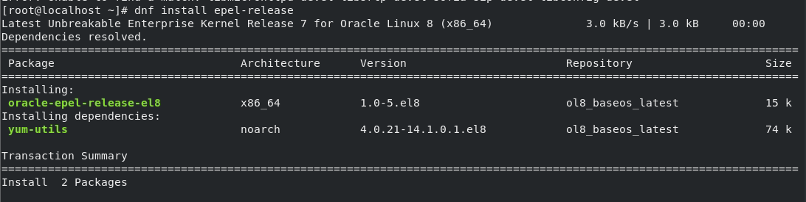
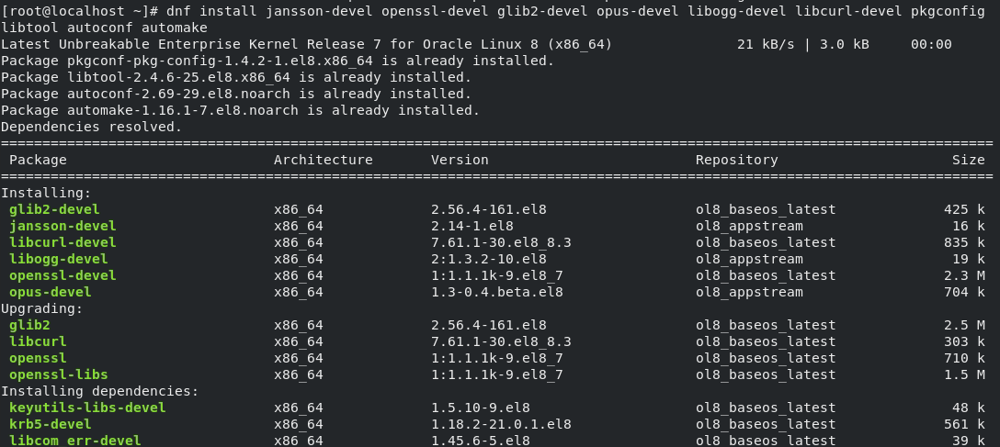
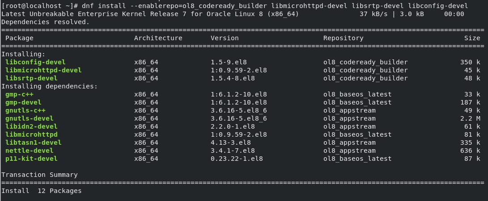
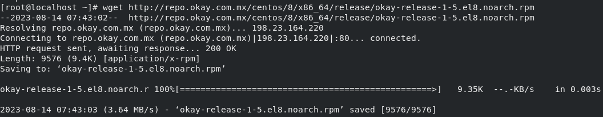
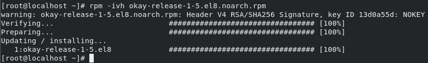
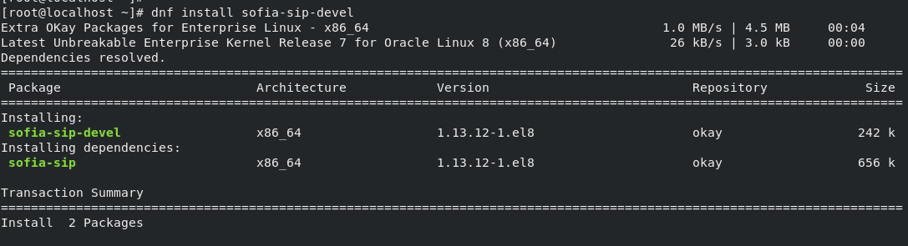
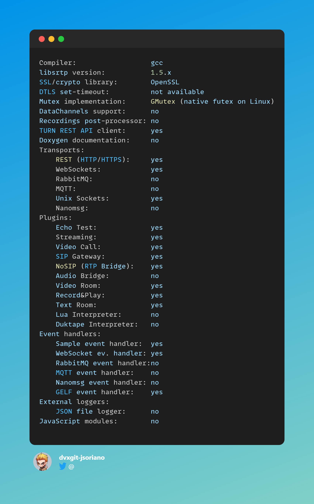
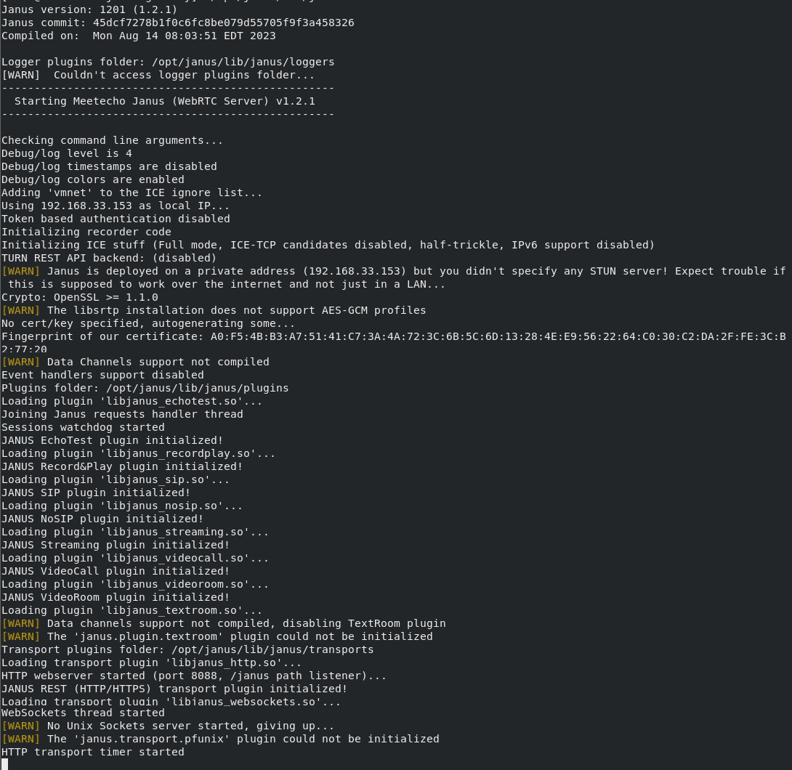

# Install-JanusGateway-OracleLinux8
This is a guide on how to install Janus Gateway on an Oracle Linux 8.7

## What is Janus Gateway
**Janus Gateway** is a **WebRTC Server** developed by Meetecho conceived to be a general purpose one. As such, it doesn't provide any functionality per se other than implementing the means to set up a WebRTC media communication with a browser, exchanging JSON messages with it, and relaying RTP/RTCP and messages between browsers and the server-side application logic they're attached to. Any specific feature/application is provided by server side plugins, that browsers can then contact via Janus to take advantage of the functionality they provide. Example of such plugins can be implementations of applications like echo tests, conference bridges, media recorders, SIP gateways and the like.

## Pre-Requisite
- [Oracle Linux 8.7](https://yum.oracle.com/oracle-linux-isos.html)
- [Janus Gateway](https://janus.conf.meetecho.com/)

NOTE: This guide will not teach you how to install Oracle Linux. Assuming you already know how to install the Oracle Linux 8. Below are the steps you can follow to install Janus Gateway.

## How to Install Janus Gateway
1. Install the epel release:

    ```
    dnf install epel-release
    ```

    

2. Install the packages below:

    ```
    dnf install jansson-devel openssl-devel glib2-devel opus-devel libogg-devel libcurl-devel pkgconfig libtool autoconf automake
    ```

    

3. Install additional packages below from ol8_codeready_builder repository

    ```
    dnf install --enablerepo=ol8_codeready_builder libmicrohttpd-devel libsrtp-devel libconfig-devel libnice-devel libwebsockets-devel
    ```

    

4. Install okey release repository:

    ```
    wget http://repo.okay.com.mx/centos/8/x86_64/release/okay-release-1-5.el8.noarch.rpm
    ```
    ```
    rpm -ivh okay-release-1-5.el8.noarch.rpm
    ```

    

    

5. Install sofia-sip-devel:

    ```
    dnf install sofia-sip-devel
    ```

    

6. Once you have installed all the dependencies, you are ready to install janus gateway. Get the code:

    ```
    git clone https://github.com/meetecho/janus-gateway.git
    ```
    ```
    cd janus-gateway
    ```

7. Then just use to generate config file:

    ```
    sh autogen.sh
    ```

8. After that, configure and compile as usual to start the whole compilation process:

    ```
    ./configure --prefix=/opt/janus
    ```
    ```
    make
    ```
    ```
    make install
    ```

    

7. Since Janus requires configuration files for both the core and its modules in order to work, you'll probably also want to install the default configuration files to use, which you can do this way:

    ```
    make configs
    ```

8. To start the server, you can use the janus executable. There are several things you can configure, either in a configuration file:

    ```
    /opt/janus/bin/janus
    ```

    

There you go! You now have a Janus Gateway with websockets and sip gateway enabled module. If you want to install other modules/transports, just browse their official website and source to find out how to enable the modules/transports.


## Developer

- [Jerome Soriano](https://github.com/dvxgit-jsoriano)

*"Feel free to read, use, and apply to your projects."*
